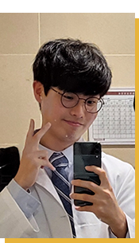

<h1>
    Hi👋, I'm Yeonseo Choo!
</h1>
{: .align-left} 
# Yeonseo Choo (추연서)
**Medical Student @ Korea University**

    

    I am a medical student currently studying at <strong>Korea University</strong>. Though I'm a medical student, I used to study <strong>CS</strong> and <strong>EE</strong> when I was at KAIST (Korea Advanced Institute of Science and Technology). 
    

    

    My field of interest is <strong>machine learning for bio-medical imaging</strong>. Recently, artificial intelligence technology has developed exponentially. As a result, the demand for AI has also increased in the medical sector.
    

# Education
<html lang="en">
<head>
    <meta charset="UTF-8">
    <meta name="viewport" content="width=device-width, initial-scale=1.0">
</head>
<body>
    

        

            

                <h2>2023 ~ Present</h2>
                
College of Medicine - <strong>Korea University </strong> 

            

        

        

            

                <h2>2022</h2>
                
Summer School - <strong>University of California, Berkeley</strong>

            

        

        

            

                <h2>2022</h2>
                
<strong>Korea Advanced Institute of Science and Technology (KAIST)</strong> (dropped out)

            

        

        

            

                <h2>2019 ~ 2021</h2>
                
<strong>Korea Science Academy of KAIST</strong>

            

        

    

</body>
</html>

# Research Experience